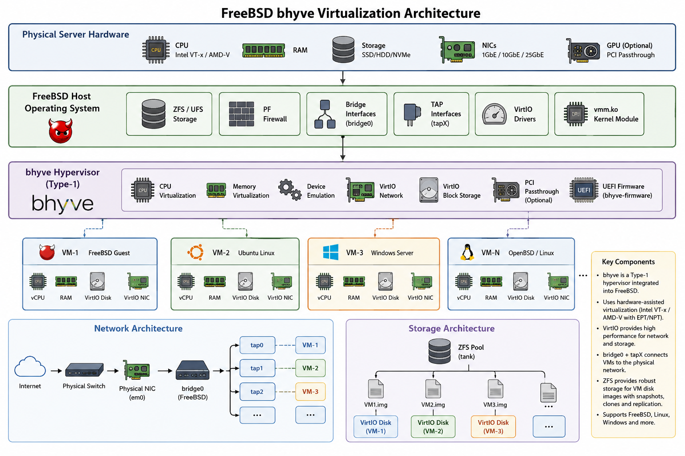

# freebsd-bhyve-virtualization-guide
# FreeBSD Bhyve + Sylve Lab

A step-by-step guide to installing, configuring, and testing FreeBSD's native hypervisor (Bhyve) together with Sylve Web UI.

## Lab Overview

This repository documents my hands-on experience building a lightweight virtualization platform using FreeBSD.

Topics covered:

- Installing FreeBSD
- Updating the system
- Installing Bhyve
- Configuring networking
- Creating virtual machines
- Installing an operating system inside Bhyve
- Installing and configuring Sylve
- Managing VMs through the web interface
- Troubleshooting common issues

## Lab Environment

| Component     | Version  |
|---------------|----------|
| FreeBSD       | 15.x     |
| Hypervisor    | Bhyve    |
| Management UI | Sylve    |
| Host OS      | PROXMOX  |

## Architecture

## Documentation

1. FreeBSD Installation
2. System Preparation
3. Installing Bhyve
4. Network Configuration
5. Installing Sylve
6. Creating Virtual Machines 
7. Testing
8. Troubleshooting

## Screenshots

All screenshots used in this guide are available under the `images/` directory.

## Learning Objectives

By completing this guide you will be able to:

- Install FreeBSD
- Configure Bhyve
- Create and manage VMs
- Configure bridged networking
- Install Sylve
- Manage virtual machines through a web interface

## References

- FreeBSD Handbook :- https://docs.freebsd.org/en/books/handbook/
- Bhyve Documentation :- https://docs.freebsd.org/en/books/handbook/virtualization/#virtualization-host-bhyve
- Sylve Documentation :- https://sylve.io/docs/

## License

MIT
