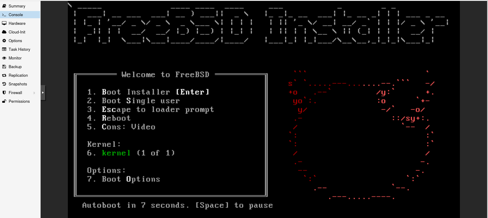

# 01 - FreeBSD Installation



> **Objective**
>
> Install FreeBSD as the host operating system that will be used to deploy and manage virtual machines with Bhyve and Sylve.

---

# Table of Contents

- Overview
- Lab Environment
- Prerequisites
- Download FreeBSD
- Create Bootable Installation Media
- Boot the Installer
- Install FreeBSD
- Configure the System
- First Login
- Verify Installation
- Next Steps

---

# Overview

FreeBSD is a mature, open-source Unix-like operating system known for its stability, security, and advanced networking capabilities. It includes the **Bhyve** hypervisor as part of the base system, making it an excellent platform for building lightweight virtualization environments.

This guide walks through the installation process of FreeBSD and prepares the system for configuring Bhyve in the following sections.

---

# Lab Environment

| Component        | Value                             |
|------------------|-----------------------------------|
| Operating System | FreeBSD 15.x                      |
| Hypervisor       | Bhyve                             |
| Web Management   | Sylve                             |
| Host Type        | Physical Server / Virtual Machine |
| CPU              | 4 vCPU (Recommended)              |
| Memory           | 8 GB Minimum (16 GB Recommended)  |
| Storage          | 50 GB Minimum                     |
| Network          | DHCP or Static IP                 |

---

# Prerequisites

Before starting, ensure you have the following:

- FreeBSD installation ISO
- Physical server or virtual machine
- Internet connection
- USB drive (if installing on physical hardware)
- Root or administrator access
- Basic understanding of command-line operations

---

# Step 1 – Download FreeBSD

Download the latest FreeBSD installation image from the official website.:- https://www.freebsd.org/where/

Choose:

- AMD64 architecture
- DVD ISO (Recommended)

Screenshot

```
(../images/01-download-freebsd.png)
```

---

# Step 2 – Create Bootable Media

### Linux

```bash
sudo dd if=FreeBSD-14.x-RELEASE-amd64-dvd1.iso of=/dev/sdX bs=4M status=progress
sync
```

Replace:

```
/dev/sdX
```

with your USB device.

### Windows

Recommended tools:

- Rufus
- Balena Etcher

---

# Step 3 – Boot from Installation Media

Restart the machine.

Select the USB/DVD as the boot device.

The FreeBSD installer will start.

Screenshot

```
images/02-installer-menu.png
```

---

# Step 4 – Start Installation

Choose

```
Install
```

Screenshot

```
images/03-install-option.png
```

---

# Step 5 – Select Keyboard Layout

Choose your preferred keyboard layout.

Example

```
US
```

Press

```
Continue
```

---

# Step 6 – Configure Hostname

Provide a meaningful hostname.

Example

```
bhyvesrv
```

or

```
freebsd-lab
```

Screenshot

```
images/04-hostname.png
```

---

# Step 7 – Select Components

Recommended components

- kernal-dbg
- lib32

These are optional but useful for development and troubleshooting.

Screenshot

```
images/05-components.png
```

---

# Step 8 – Partition the Disk

For a lab environment, select:

```
Auto (ZFS)
```

Recommended options:

- Pool Name: zroot
- GPT Partition Scheme
- Stripe
- Force 4K Sectors (if applicable)

Screenshot

```
images/06-zfs-install.png
```

---

# Step 9 – Configure Network

Select the available network interface.

Example

```
em0
```

or

```
igb0
```

Choose:

- DHCP (Recommended)

or

Configure a static IP address if required.

Screenshot

```
images/07-network-config.png
```

---

# Step 10 – Set Time Zone

Choose:

- Region
- Country
- Time Zone

Enable:

```
IST
```

if appropriate for your environment.

---

# Step 11 – Configure Services

Recommended services:

- SSH
- NTP
- PowerD (Physical Machine)
- Dumpdev

Screenshot

```
images/08-services.png
```

---

# Step 12 – Configure System Hardening

Recommended selections:

- Disable Sendmail
- Disable Debugging
- Randomize PID

These settings improve the default security posture of the system.

---

# Step 13 – Create Root Password

Enter a strong password.


```
images/08.1-root.png

```

Do not use weak passwords in production environments.

---

# Step 14 – Create an Administrative User

Example

| Field | Value |
|------|------|
| Username | itadmin |
| Full Name | System Administrator |
| Group | wheel |

When prompted:

```
Invite user into other groups?
```

Select

```
wheel
```

This allows the user to execute administrative commands using `su` or `sudo`.

Screenshot

```
images/09-user-creation.png
```

---

# Step 15 – Final Configuration

Review the installation summary.

Select

```
Exit Installer
```

Remove the installation media.

Reboot the system.

---

# First Login

Login using the account created during installation.

Example

```text
login: admin
Password:
```

Switch to the root user if needed.

```bash
su -
```

---

# Verify Installation

Check the installed FreeBSD version.

```bash
freebsd-version
```

Example output

```text
15.0-RELEASE
```

---

Check system information.

```bash
uname -a
```

Example

```text
FreeBSD bhyve-host 15.0-RELEASE amd64
```

---

Verify network connectivity.

```bash
ping -c 4 google.com
```

Expected output

```text
64 bytes from ...
```

---

Check disk usage.

```bash
df -h
```

---

Display network interfaces.

```bash
ifconfig
```

---

# Installation Checklist

- [x] FreeBSD installed
- [x] Network configured
- [x] Root password created
- [x] Administrative user created
- [x] SSH enabled
- [x] System booted successfully
- [x] Internet connectivity verified

---

# Best Practices

- Use ZFS for improved storage management.
- Create a non-root administrative user.
- Enable SSH for remote management.
- Keep the operating system updated.
- Record installation details for future reference.

---

# Notes

This guide uses a clean installation of FreeBSD 14.x. Minor differences may exist between releases, but the overall installation workflow remains consistent.

The next document covers preparing the operating system by updating packages, installing essential utilities, and configuring the environment for Bhyve.

---

# Next Step

➡ Continue with **02-System-Preparation.md**

---

# References

- FreeBSD Handbook
- FreeBSD Release Notes
- Bhyve Documentation

---

**Author:** *mohammed umar*

**Repository:** *freebsd-bhyve-sylve-lab*

**Last Updated:** July 2026
