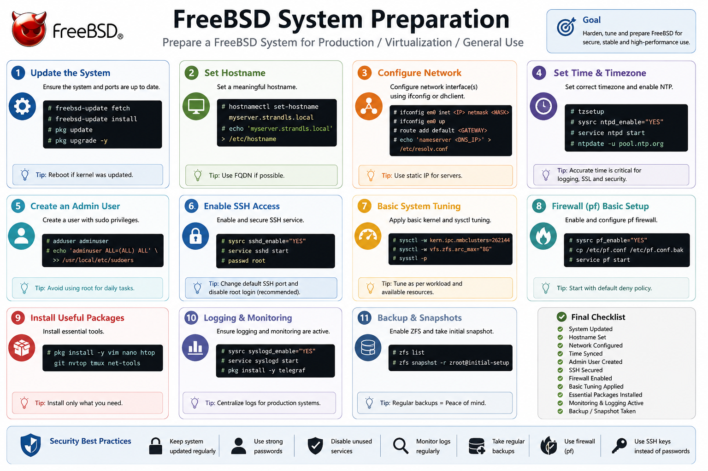
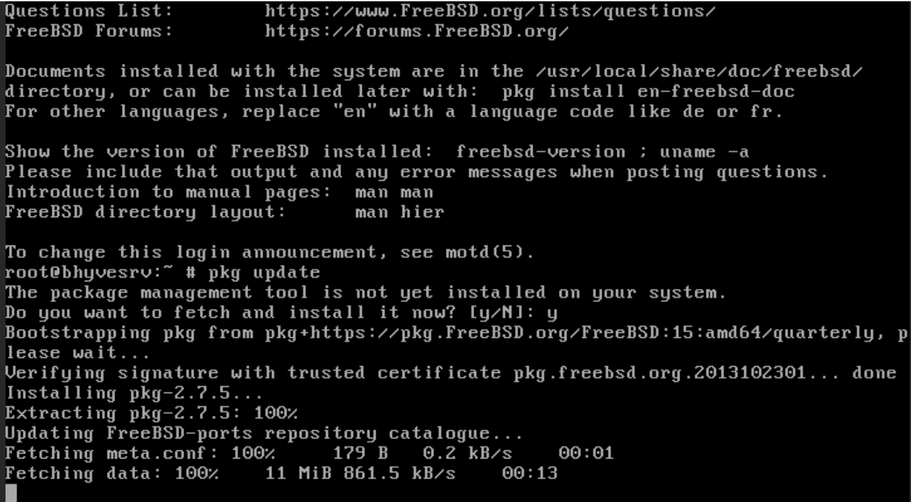
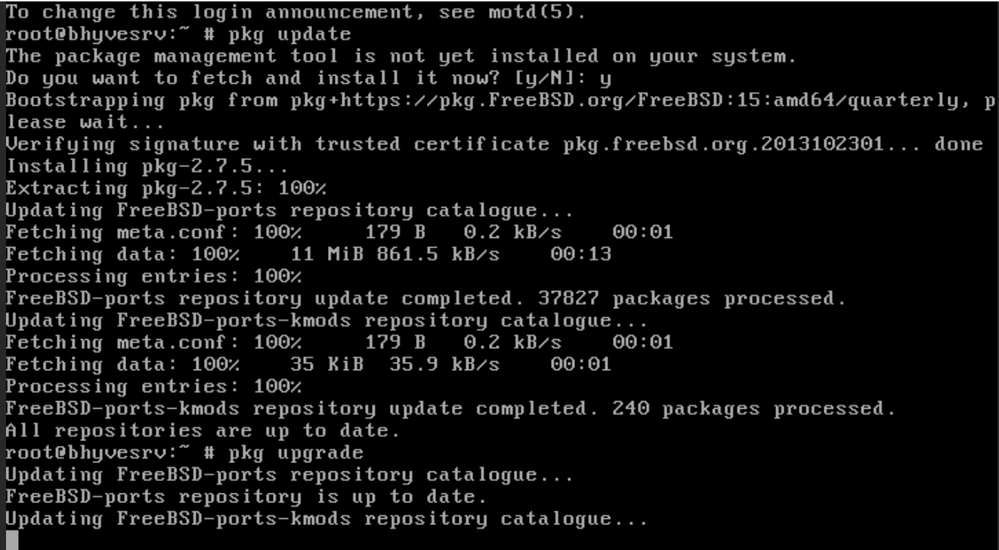
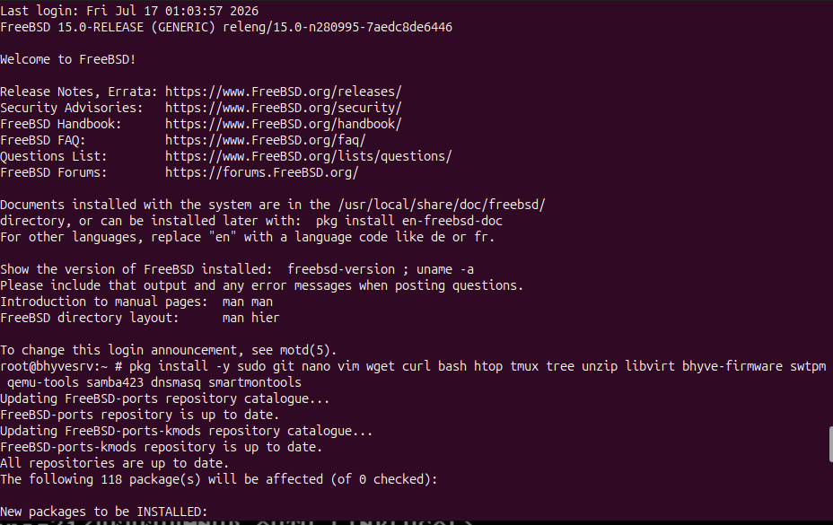

# 02 - System Preparation



> **Objective**
>
> Prepare the FreeBSD host for virtualization by updating the operating system, installing essential utilities, enabling required services, and configuring the environment for Bhyve.

---

# Table of Contents

- Overview
- Prerequisites
- Update FreeBSD
- Install Required Packages
- Configure Sudo
- Enable Services
- Verify Internet Connectivity
- Configure Time Synchronization
- System Information
- Verification
- Best Practices
- Next Steps

---

# Overview

A freshly installed FreeBSD system should always be updated before deploying additional software. This chapter covers updating packages, installing common administration tools, and preparing the operating system for Bhyve.

---

# Prerequisites

- FreeBSD installed
- Root or sudo privileges
- Active Internet connection

---

# Update Package Repository

```bash
pkg update
```

Expected Output

```
Updating FreeBSD repository catalogue...
```

Screenshot





---

# Upgrade Installed Packages

```bash
pkg upgrade
```

This updates all installed packages to the latest available versions.

Screenshot



---

# Install Essential Utilities

```bash
pkg install -y sudo git nano vim wget curl bash htop tmux tree unzip libvirt bhyve-firmware swtpm qemu-tools samba423 dnsmasq smartmontools
```

Package Description

| Package | Purpose |
|----------|----------|
| sudo | Administrative commands |
| git | Clone repositories |
| curl | Download files |
| wget | Download utilities |
| nano | Text editor |
| vim | Advanced text editor |
| bash | Alternative shell |
| htop | Resource monitoring |
| tmux | Terminal multiplexer |
| tree | Directory structure |
| unzip | Extract archives |

Screenshot



---

# Install Networking Tools

```bash
pkg install nmap netcat bind-tools
```

Useful for troubleshooting network connectivity.

---

# Configure sudo

Edit sudoers safely.

```bash
visudo
```

Ensure the wheel group has administrative access.

```
%wheel ALL=(ALL:ALL) ALL
```

---

# Enable Required Services

Enable SSH

```bash
sysrc sshd_enable="YES"
```

Enable NTP

```bash
sysrc ntpd_enable="YES"
```

Enable Power Management (Physical Servers)

```bash
sysrc powerd_enable="YES"
```

Start services

```bash
service sshd start
service ntpd start
service powerd start
```

---

# Verify Network Connectivity

Display network interfaces

```bash
ifconfig
```

Ping Gateway

```bash
ping -c 4 <gateway-ip>
```

Ping Internet

```bash
ping -c 4 google.com
```

Verify DNS

```bash
drill google.com
```

---

# Display System Information

```bash
hostname
```

```bash
freebsd-version
```

```bash
uname -a
```

```bash
uptime
```

---

# Check Disk Usage

```bash
df -h
```

---

# Check Memory

```bash
top
```

---

# Verification Checklist

- [x] Package repository updated
- [x] System upgraded
- [x] Essential tools installed
- [x] SSH enabled
- [x] NTP enabled
- [x] Internet working
- [x] DNS resolving correctly

---

# Best Practices

- Keep the operating system updated.
- Use SSH keys instead of passwords.
- Install only required packages.
- Regularly verify system health.

---

# Next Step

➡ Continue with **03-Installing-Bhyve.md**
