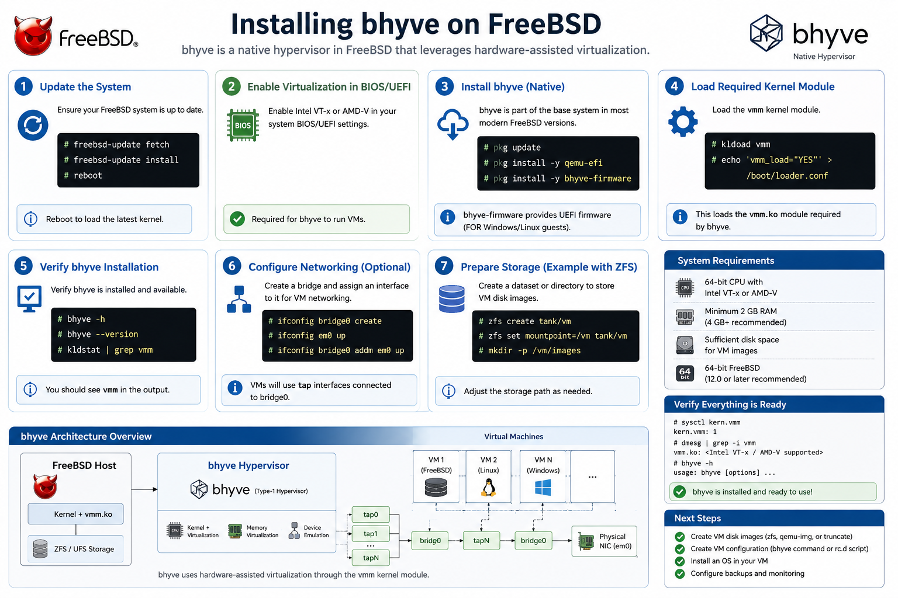
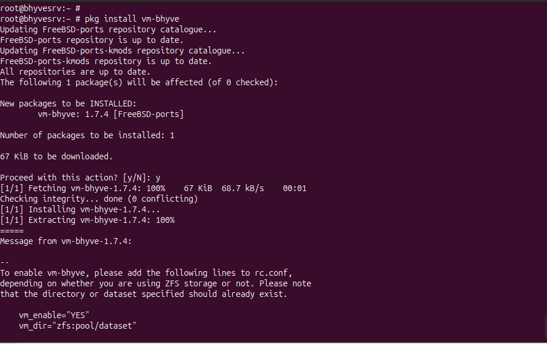

# 03 - Installing Bhyve



> **Objective**
>
> Install and configure the Bhyve hypervisor along with vm-bhyve to simplify virtual machine management.

---

# Table of Contents

- Overview
- Prerequisites
- Install Packages
- Configure ZFS Dataset
- Configure vm-bhyve
- Download Templates
- Configure Boot Loader
- Verification
- Best Practices
- Next Steps

---

# Overview

Bhyve is FreeBSD's native hypervisor designed for running modern virtual machines efficiently. While Bhyve provides the virtualization engine, **vm-bhyve** simplifies VM creation and management through an easy-to-use command-line interface.

---

# Prerequisites

- FreeBSD installed
- ZFS storage available
- Root access
- Internet connectivity

---

# Install Required Packages

```bash
pkg install -y vm-bhyve grub2-bhyve bhyve-firmware uefi-edk2-bhyve 
```

Package Description

| Package | Purpose |
|----------|----------|
| vm-bhyve | VM management |
| grub2-bhyve | Linux bootloader |
| bhyve-firmware | Firmware support |
| uefi-edk2-bhyve | UEFI firmware |

Screenshot




---

# Create ZFS Dataset

```bash
zfs create zroot/vm
```

Verify

```bash
zfs list
```

Expected Output

```
zroot/vm
```

---

# Initialize vm-bhyve

Create the default datastore.

```bash
vm init /zroot/vm
```

---

# Configure Templates

Create template directory.

```bash
mkdir -p /zroot/vm/.templates
```

Fetch templates.

```bash
vm getall
```

Verify

```bash
vm ls
```

---

# Configure Loader

Edit

```bash
nano /boot/loader.conf
```

Add

```
vmm_load="YES"
nmdm_load="YES"
if_bridge_load="YES"
if_tap_load="YES"
```

Save the file.

---

# Load Kernel Modules

Without rebooting

```bash
kldload vmm
kldload if_tap
kldload if_bridge
```

Verify

```bash
kldstat
```

Expected Output

```
vmm.ko
if_bridge.ko
if_tap.ko
```

---

# Enable Required Services

```bash
sysrc vm_enable="YES"
```

---

# Check vm-bhyve Configuration

```bash
vm version
```

Expected Output

```
vm-bhyve version ...
```

---

# Verify Bhyve

Display available templates

```bash
vm getall
```

Display datasets

```bash
zfs list
```

Display loaded modules

```bash
kldstat
```

Display VM datastore

```bash
vm datastore
```

---

# Verification Checklist

- [x] Packages installed
- [x] ZFS datastore created
- [x] vm initialized
- [x] Templates downloaded
- [x] Kernel modules loaded
- [x] Loader configured
- [x] vm-bhyve working

---

# Best Practices

- Store virtual machines on ZFS.
- Use UEFI firmware for modern operating systems.
- Keep templates updated.
- Separate VM storage from the operating system.

---

# Common Issues

## vm: command not found

Verify installation

```bash
pkg info vm-bhyve
```

---

## Module Not Loaded

```bash
kldload vmm
```

---

## ZFS Dataset Missing

```bash
zfs create zroot/vm
```

---

## Permission Denied

Ensure commands are executed as root.

```bash
su -
```

---

# Next Step

➡ Continue with **04-Network-Configuration.md**
