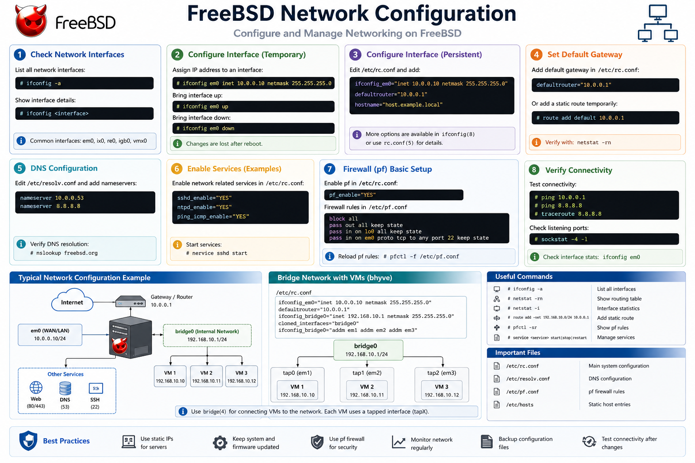
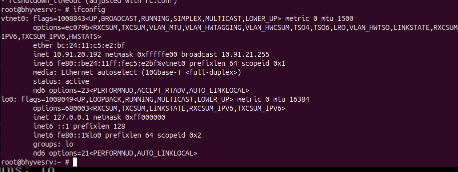

# 04 - Network Configuration



> **Objective**
>
> Configure bridged networking on FreeBSD so that Bhyve virtual machines can communicate directly with the local network and access external resources.

---

# Table of Contents

- Overview
- Network Topology
- Prerequisites
- Identify Network Interface
- Create Bridge Interface
- Enable Bridge at Boot
- Configure vm-bhyve Networking
- Test Connectivity
- Verification
- Best Practices
- Troubleshooting
- Next Step

---

# Overview

Bhyve uses **tap** interfaces connected to a **bridge** interface. The bridge links virtual machines to the physical network, allowing them to receive IP addresses from the same network as the host.

Network Flow:

```
Internet
    │
Router
    │
Physical NIC (em0/igb0)
    │
Bridge (bridge0)
    │
Tap Interfaces
    │
Virtual Machines
```

---

# Prerequisites

- FreeBSD installed
- vm-bhyve installed
- Root privileges

---

# Step 1 – Identify the Physical Network Interface

Display all interfaces:

```bash
ifconfig
```

Example output:

```
vnet0
em0
lo0
bridge0
```

In this guide, **vnet0** is used as the virtual interface. Replace it with your interface if different.

Screenshot:




---

# Step 2 – Load Required Kernel Modules

```bash
kldload if_bridge
kldload if_tap
```

Verify:

```bash
kldstat
```

---

# Step 3 – Create a Bridge Interface

```bash
ifconfig bridge0 create
```

Attach the physical interface:

```bash
ifconfig bridge0 addm em0
```

Bring the bridge online:

```bash
ifconfig bridge0 up
```

Verify:

```bash
ifconfig bridge0
```


---

# Step 4 – Configure Bridge at Boot

Edit `/etc/rc.conf`:

```bash
nano /etc/rc.conf
```

Add:

```text
cloned_interfaces="bridge0 tap0"
ifconfig_bridge0="addm em0 addm tap0 up"
```

Save the file.

---

# Step 5 – Configure vm-bhyve Networking

Edit the vm-bhyve configuration:

```bash
nano /zroot/vm/.config/system.conf
```

Example:

```text
network0_type="virtio-net"
network0_switch="public"
```

Create the network switch:

```bash
vm switch create public
```

Attach the bridge:

```bash
vm switch add public bridge0
```

Verify:

```bash
vm switch list
```

---

# Step 6 – Test Network Connectivity

Verify host connectivity:

```bash
ping -c 4 google.com
```

Check routing table:

```bash
netstat -rn
```

Check DNS:

```bash
drill freebsd.org
```

---

# Verification

Display bridge information:

```bash
ifconfig bridge0
```

Display switches:

```bash
vm switch list
```

Expected Results:

- bridge0 exists
- tap interface attached
- Internet connectivity working
- VM switch available

---

# Best Practices

- Use bridged networking for production-style environments.
- Keep the host firewall configured appropriately.
- Use descriptive switch names (public, private, dmz).
- Document all network changes.

---

# Troubleshooting

### Bridge Not Created

```bash
ifconfig bridge0 create
```

### No Internet Access

Check:

```bash
ifconfig
netstat -rn
```

### VM Cannot Reach Network

Verify:

```bash
vm switch list
```

Ensure the switch is connected to `bridge0`.

---

# Verification Checklist

- [x] Bridge created
- [x] Bridge active
- [x] Physical NIC attached
- [x] vm switch created
- [x] Internet reachable

---

# Next Step

➡ Continue with **05-Creating-Virtual-Machines.md**
