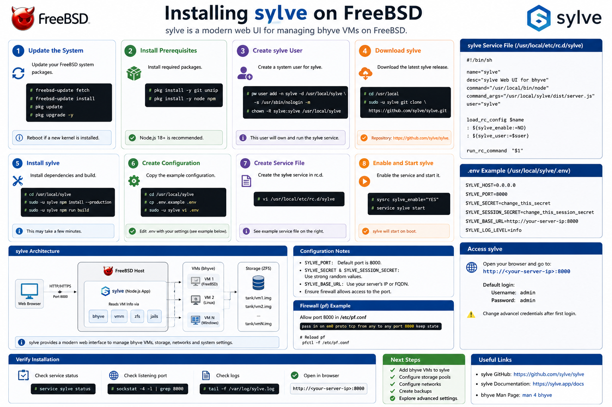
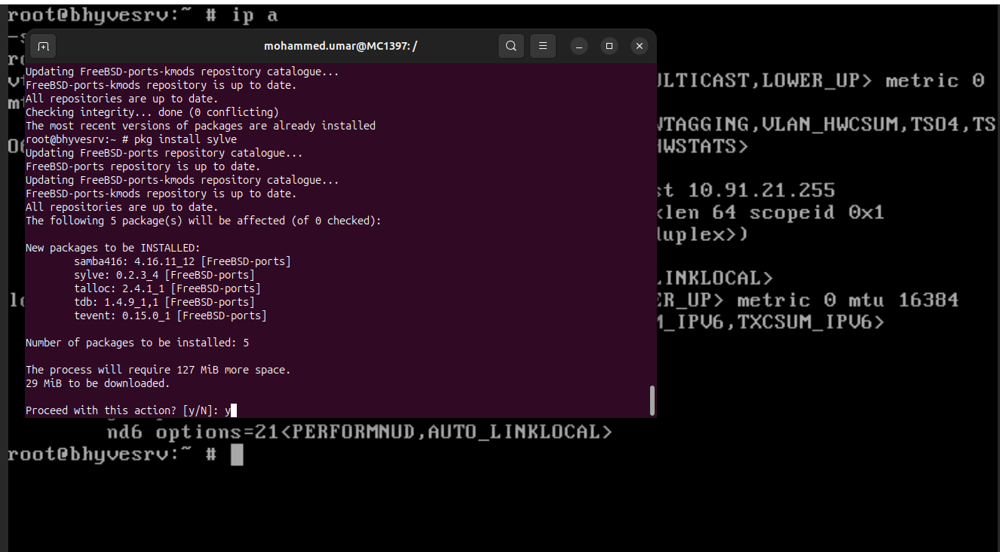
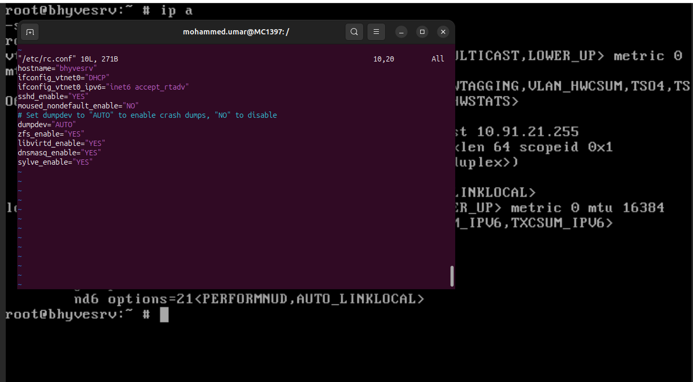
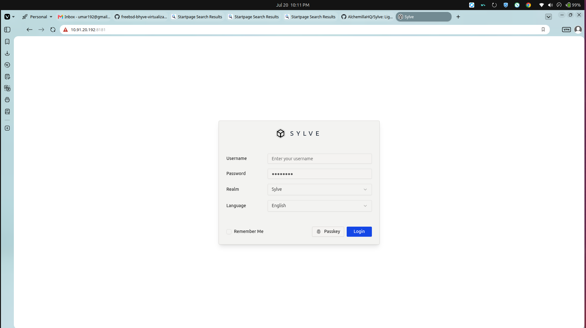
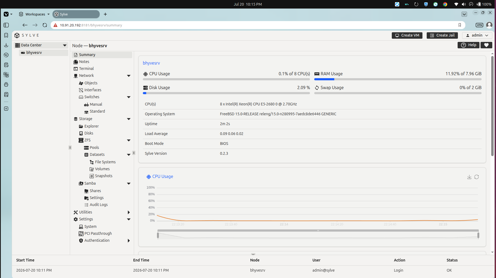
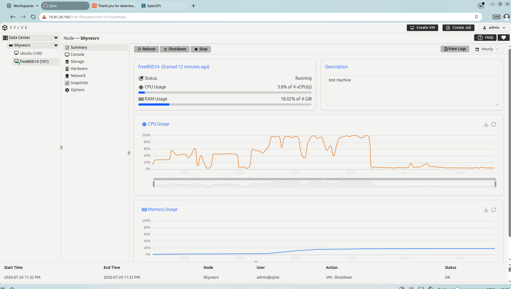
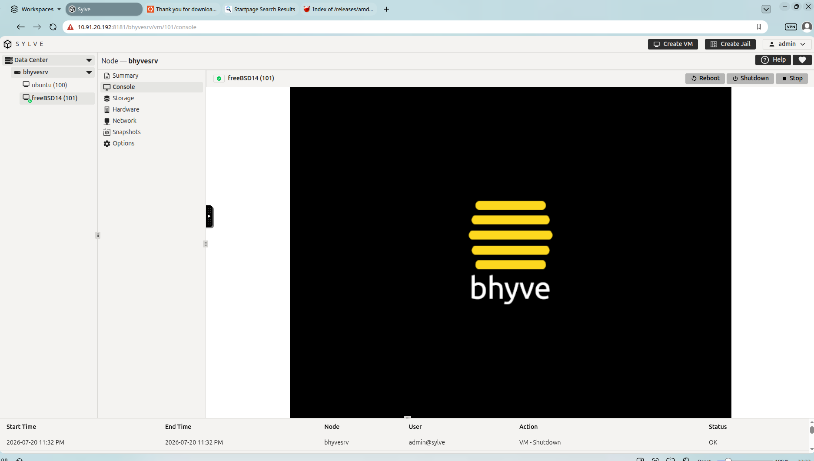
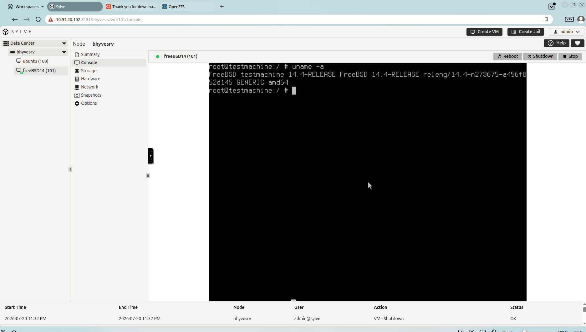

# 06 - Installing Sylve



> **Objective**
>
> Install, configure, and verify Sylve, a web-based management interface for FreeBSD Bhyve virtual machines.

---

# Table of Contents

- Overview
- Prerequisites
- Installing Dependencies
- Installing Sylve
- Starting the Service
- Accessing the Web Interface
- Managing Virtual Machines
- Verification
- Best Practices
- Common Issues
- Next Step

---

# Overview

Managing virtual machines from the command line is efficient, but a graphical interface simplifies monitoring, administration, and day-to-day operations.

Sylve provides a lightweight web interface for managing Bhyve virtual machines. It allows administrators to:

- View virtual machines
- Start and stop VMs
- Monitor VM status
- Access VM details
- Simplify virtualization management

This guide demonstrates a basic installation and verification of Sylve.

---

# Prerequisites

Before installing Sylve, ensure the following:

- FreeBSD 15.x installed
- Bhyve configured
- vm-bhyve installed
- Network bridge configured
- Root or sudo privileges
- Internet connectivity

---

# Step 1 - Update Package Repository

```bash
pkg update
```

Upgrade installed packages.

```bash
pkg upgrade
```

---

# Step 2 - Install Required Dependencies

Install common dependencies.

```bash
pkg install -y libvirt bhyve-firmware swtpm qemu-tools samba423 dnsmasq smartmontools tmux
```

Verify installation.

```bash
pkg info
```

---

# Step 3 - Install Sylve


```bash
pkg install sylve
```


> **Note**
>
> Sylve pakage is available in FreeBSD Pakage Manager.


Screenshot



---

# Step 4 - Configure Sylve

add configuration to /etc/rc.conf.

Typical settings include:

- ZFS enable 
- Sylve enable
- libvirtd enable
- dsmasq enable

sysrc zfs_enable="YES"
sysrc libvirtd_enable="YES"
sysrc dnsmasq_enable="YES"
sysrc sylve_enable="YES"


Screenshot



---

# Step 5 - Start Sylve

Start the application according to its documentation.

Verify the process is running.


```bash
service sylve start
```

```bash
ps aux | grep sylve
```

Check listening ports.

```bash
sockstat -4 -l
```

Expected output

```
*:8181
```


---

# Step 6 - Allow Firewall Access

If PF or another firewall is enabled, allow inbound access to the configured web port.

Example:

```
Pass TCP traffic to port 8181
```

Reload firewall configuration if necessary.

---

# Step 7 - Access the Web Interface

Open your browser.

```
http://<server-ip>:8181
```

Example

```
http://192.168.1.20:8080
```

You should see the Sylve login page.

Screenshot



---

# Step 8 - Log In

Authenticate using the configured administrator credentials.

After login you should see:

- Dashboard
- VM List
- Host Information
- Available Resources

Screenshot



---

# Step 9 - Manage Virtual Machines

Typical operations include:

Start a VM

Stop a VM

Restart a VM

View VM Information

Open Console

Monitor Status

Take screenshots for each operation.

Example screenshots





---

# Verification

Confirm that:

- Sylve dashboard loads successfully.
- Existing virtual machines are visible.
- Host information is displayed.
- VM status updates correctly.
- Start and Stop operations work as expected.

---

# Verification Commands

Verify running services.

```bash
service -e
```

Check listening ports.

```bash
sockstat -4 -l
```

Verify VM status.

```bash
vm list
```

Expected Result

```
VM Name
State: Running
```

---

# Best Practices

- Restrict access to trusted networks.
- Use strong administrator credentials.
- Keep FreeBSD packages updated.
- Regularly back up VM configurations.
- Monitor host resource usage.
- Document configuration changes.

---

# Common Issues

## Unable to Access Web Interface

Verify:

```bash
sockstat -4 -l
```

Check:

- Firewall rules
- Server IP
- Listening port

---

## Dashboard Loads but No VMs

Verify datastore.

```bash
vm list
```

Confirm Sylve is pointed to the correct vm-bhyve datastore.

---

## Service Not Running

Review application logs.

Restart the service according to the project's documentation.

---

## Permission Denied

Ensure the service account has permission to access:

```
/zroot/vm
```

---

# Installation Checklist

- [x] Dependencies installed
- [x] Sylve downloaded
- [x] Configuration completed
- [x] Service started
- [x] Dashboard accessible
- [x] VM list visible
- [x] VM operations tested

---

# Next Step

Continue with **07-Testing.md** to validate the complete virtualization environment.

---

# References

- FreeBSD Handbook
- Bhyve Documentation
- vm-bhyve Documentation
- Sylve Official Documentation

---

**Author:** *Mohammed Umar*

**Repository:** *freebsd-bhyve-sylve-lab*

**Last Updated:** July 2026
````
