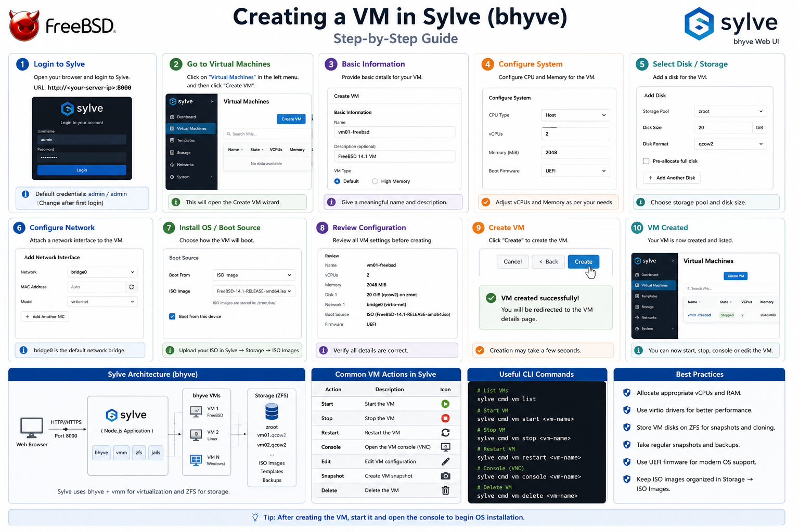

# Creating a Virtual Machine Using Sylve



> **Objective**
>
> Learn how to create, configure, and deploy a virtual machine using the Sylve web interface for FreeBSD Bhyve.

---

# Table of Contents

- Overview
- Prerequisites
- Accessing the Sylve Dashboard
- Creating a New Virtual Machine
- Configuring CPU and Memory
- Configuring Storage
- Configuring Networking
- Selecting Installation Media
- Starting the Virtual Machine
- Accessing the VM Console
- Verifying the Installation
- Managing Virtual Machines
- Best Practices
- Troubleshooting

---

# Overview

Sylve provides an intuitive web interface for managing Bhyve virtual machines without relying solely on the command line. From a single dashboard, administrators can create, configure, start, stop, and monitor virtual machines.

This guide demonstrates the complete process of deploying a new Ubuntu Server virtual machine using Sylve.

---

# Prerequisites

Ensure the following requirements are completed:

- FreeBSD installed
- Bhyve configured
- vm-bhyve installed
- Sylve installed and running
- Network bridge configured
- Ubuntu Server ISO available

---

# Step 1 - Access the Sylve Dashboard

Open your preferred web browser.

```
http://<server-ip>:8080
```

Example

```
http://192.168.1.20:8080
```

Login using your administrator credentials.

Screenshot

```
images/60-login-dashboard.png
```

---

# Step 2 - Open Virtual Machines

From the navigation menu select

```
Virtual Machines
```

The page displays all available virtual machines.

Screenshot

```
images/61-vm-list.png
```

---

# Step 3 - Create a New Virtual Machine

Click

```
Create VM
```

or

```
+ New Virtual Machine
```

Screenshot

```
images/62-create-vm-button.png
```

---

# Step 4 - Configure Basic Information

Enter the following information.

| Field | Example |
|---------|---------|
| VM Name | ubuntu01 |
| Description | Ubuntu Server Lab |
| Guest OS | Ubuntu Linux |
| Boot Firmware | UEFI |

Screenshot

```
images/63-basic-settings.png
```

---

# Step 5 - Configure CPU

Allocate virtual processors.

Example

```
2 vCPU
```

Recommended

| Host RAM | Suggested vCPU |
|----------|----------------|
| 8 GB | 2 |
| 16 GB | 2-4 |
| 32 GB | 4-8 |

Screenshot

```
images/64-cpu-settings.png
```

---

# Step 6 - Configure Memory

Assign memory.

Example

```
4096 MB
```

Recommended

| Guest OS | Memory |
|----------|--------|
| Ubuntu Server | 2-4 GB |
| Debian | 2 GB |
| FreeBSD | 2 GB |

Screenshot

```
images/65-memory.png
```

---

# Step 7 - Configure Virtual Disk

Create a new virtual disk.

Example

| Setting | Value |
|---------|-------|
| Size | 20 GB |
| Disk Type | VirtIO Block |
| Storage Pool | zroot/vm |

Screenshot

```
images/66-storage.png
```

---

# Step 8 - Configure Networking

Select the bridge configured previously.

Example

```
Bridge: bridge0
```

or

```
Switch: public
```

Adapter

```
VirtIO Network
```

Screenshot

```
images/67-network.png
```

---

# Step 9 - Attach Installation ISO

Browse available ISO images.

Select

```
ubuntu-24.04-live-server-amd64.iso
```

Boot Device

```
CD-ROM
```

Screenshot

```
images/68-select-iso.png
```

---

# Step 10 - Review Configuration

Review all settings.

Example

```
VM Name      : ubuntu01
CPU          : 2
Memory       : 4096 MB
Disk         : 20 GB
Network      : bridge0
Boot         : UEFI
ISO          : Ubuntu Server
```

Screenshot

```
images/69-review.png
```

---

# Step 11 - Create the Virtual Machine

Click

```
Create
```

Sylve will create the VM configuration and virtual disk.

Screenshot

```
images/70-vm-created.png
```

---

# Step 12 - Start the Virtual Machine

Select

```
Start
```

Status should change to

```
Running
```

Screenshot

```
images/71-vm-running.png
```

---

# Step 13 - Open Console

Click

```
Console
```

The guest operating system installer will appear.

Proceed with the Ubuntu installation.

Screenshot

```
images/72-console.png
```

---

# Step 14 - Install Ubuntu

Complete the operating system installation.

Typical configuration includes

- Language
- Keyboard
- Network
- Username
- Password
- Storage Layout
- SSH Server

Screenshot

```
images/73-ubuntu-install.png
```

---

# Step 15 - Verify the Virtual Machine

After installation completes

Verify

- VM is running
- Guest received IP address
- Internet access works
- SSH login succeeds

Inside Ubuntu

```bash
ip addr
```

```bash
ping google.com
```

```bash
hostnamectl
```

Screenshot

```
images/74-verification.png
```

---

# Managing Virtual Machines

Common actions available in Sylve

- Start
- Stop
- Restart
- Force Shutdown
- View Console
- Edit Configuration
- Delete VM

Screenshot

```
images/75-actions.png
```

---

# Verification Checklist

- [x] VM created
- [x] CPU configured
- [x] Memory allocated
- [x] Virtual disk created
- [x] Network attached
- [x] ISO mounted
- [x] VM started
- [x] Console accessible
- [x] Ubuntu installed
- [x] Internet connectivity verified

---

# Best Practices

- Use descriptive VM names.
- Allocate only the resources required.
- Prefer VirtIO devices for better performance.
- Keep installation ISOs in a dedicated storage location.
- Regularly back up VM configurations.
- Remove unused virtual disks.

---

# Troubleshooting

## VM Does Not Start

Verify

- CPU allocation
- Memory allocation
- Boot firmware
- ISO attachment

---

## Console Not Opening

Verify

- VM status is Running.
- Browser pop-ups are not blocked.
- Console service is active.

---

## No Network Connectivity

Check

- Bridge configuration
- VM switch
- DHCP availability
- Firewall configuration

---

## ISO Not Visible

Verify the ISO is stored in the configured ISO directory and that Sylve has permission to access it.

---

# Conclusion

You have successfully created and deployed a virtual machine using the Sylve web interface. The VM is now ready for operating system installation, testing, and day-to-day management through Sylve.

---

**Next Step**

Continue with **07-Testing.md** to validate the complete FreeBSD Bhyve virtualization environment.

---

**Author:** *Your Name*

**Repository:** *freebsd-bhyve-sylve-lab*
````
