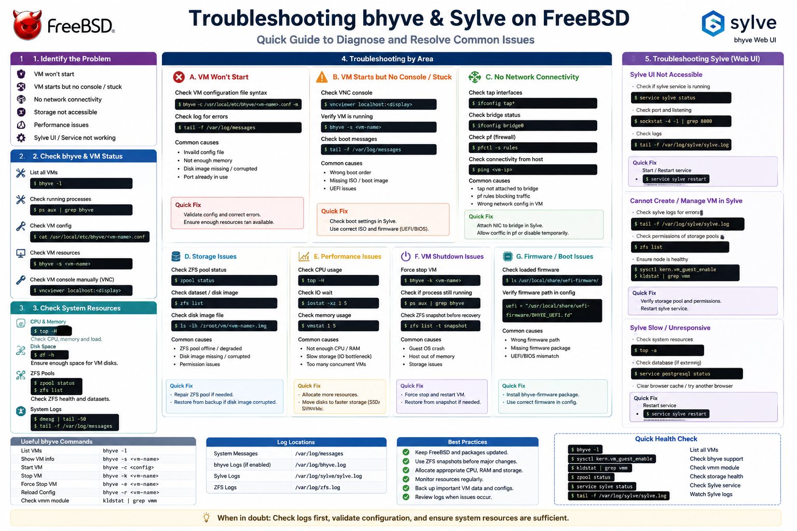

# 07 - Troubleshooting



> **Objective**
>
> Diagnose and resolve common issues encountered while installing and managing FreeBSD, Bhyve, vm-bhyve, networking, virtual machines, and the Sylve web interface.

---

# Table of Contents

- Overview
- Prerequisites
- Troubleshooting Methodology
- FreeBSD Issues
- Bhyve Issues
- vm-bhyve Issues
- ZFS Issues
- Network Issues
- Virtual Machine Issues
- Ubuntu Guest Issues
- Sylve Issues
- Performance Issues
- Log Files
- Useful Commands
- Best Practices
- References

---

# Overview

Even with careful configuration, virtualization environments may encounter issues related to hardware compatibility, networking, storage, permissions, or software configuration.

This guide provides solutions for the most common problems encountered while building a FreeBSD Bhyve virtualization lab.

---

# Prerequisites

Before troubleshooting, verify that:

- FreeBSD installation completed successfully
- System packages are updated
- Bhyve packages are installed
- vm-bhyve is configured
- Network bridge exists
- ZFS datastore is available
- Sylve is installed

---

# Troubleshooting Methodology

When an issue occurs, follow these steps:

1. Read the error message carefully.
2. Verify recent configuration changes.
3. Check system logs.
4. Confirm required services are running.
5. Verify networking.
6. Restart the affected service.
7. Reboot the host if necessary.
8. Consult official documentation if the issue persists.

---

# Issue 1 - Package Repository Not Updating

### Symptoms

```text
pkg update
```

returns errors such as:

```text
repository catalogue unavailable
```

### Possible Causes

- No Internet connection
- DNS resolution failure
- Repository temporarily unavailable

### Solution

Verify Internet access.

```bash
ping -c 4 8.8.8.8
```

Verify DNS.

```bash
drill freebsd.org
```

Retry updating.

```bash
pkg update -f
```


---

# Issue 2 - vmm Module Not Loaded

### Symptoms

```text
No such file or directory
```

or

```text
Operation not supported
```

when starting a VM.

### Verify

```bash
kldstat
```

### Solution

Load the module manually.

```bash
kldload vmm
```

To load automatically after reboot, add the following to `/boot/loader.conf`:

```text
vmm_load="YES"
nmdm_load="YES"
if_bridge_load="YES"
if_tap_load="YES"
```

---

# Issue 3 - vm Command Not Found

### Symptoms

```text
vm: Command not found
```

### Verify

```bash
pkg info vm-bhyve
```

### Solution

Install the package.

```bash
pkg install vm-bhyve
```

Verify.

```bash
vm version
```


---

# Issue 4 - VM Will Not Start

### Symptoms

```text
Failed to start VM
```

### Verify

```bash
vm list
```

Review VM configuration.

```bash
vm info <vm-name>
```

### Common Causes

- Missing ISO
- Incorrect firmware
- Insufficient memory
- Missing datastore
- Invalid configuration

### Solution

Verify:

- Boot firmware
- Disk image
- Memory allocation
- CPU allocation
- ZFS datastore

---

# Issue 5 - ZFS Datastore Missing

### Symptoms

```text
Dataset does not exist
```

### Verify

```bash
zfs list
```

### Solution

Create the datastore.

```bash
zfs create zroot/vm
```

Initialize vm-bhyve.

```bash
vm init /zroot/vm
```


---

# Issue 6 - Network Bridge Not Working

### Symptoms

- Guest cannot access the network
- No IP address assigned
- Cannot reach gateway

### Verify

```bash
ifconfig bridge0
```

### Verify Interfaces

```bash
ifconfig
```

Ensure:

- bridge0 exists
- Physical interface attached
- tap interface attached

### Solution

Recreate the bridge if necessary.

```bash
ifconfig bridge0 create
```

Add interfaces.

```bash
ifconfig bridge0 addm em0
ifconfig bridge0 addm tap0
```

---

# Issue 7 - No Internet Inside the VM

### Symptoms

```bash
ping google.com
```

fails.

### Verify

Inside Ubuntu.

```bash
ip addr
```

Verify gateway.

```bash
ip route
```

Verify DNS.

```bash
cat /etc/resolv.conf
```

### Solution

Check:

- DHCP
- Bridge configuration
- Firewall
- DNS server


---

# Issue 8 - Unable to SSH into the VM

### Symptoms

```text
Connection refused
```

### Verify

Check SSH service.

```bash
systemctl status ssh
```

or

```bash
systemctl status sshd
```

### Solution

Install OpenSSH if missing.

```bash
sudo apt install openssh-server
```

Enable the service.

```bash
sudo systemctl enable ssh
sudo systemctl start ssh
```

Verify firewall rules.

---

# Issue 9 - VM Console Does Not Open

### Symptoms

Blank console window or connection failure.

### Verify

```bash
vm list
```

Ensure the VM is running.

### Solution

Restart the VM.

```bash
vm restart <vm-name>
```

Verify browser compatibility and ensure pop-ups or WebSocket connections are not blocked.

---

# Issue 10 - Sylve Dashboard Not Accessible

### Symptoms

Browser displays:

```text
Unable to connect
```

### Verify Listening Ports

```bash
sockstat -4 -l
```

### Verify Service

```bash
service -e
```

### Solution

- Restart the Sylve service.
- Confirm the configured port.
- Check firewall rules.
- Verify the server IP address.


---

# Issue 11 - High CPU Usage

### Verify

```bash
top
```

or

```bash
htop
```

### Possible Causes

- Too many running VMs
- Insufficient CPU allocation
- Background processes

### Solution

- Stop unused VMs.
- Increase host resources.
- Reduce VM CPU allocation if appropriate.

---

# Issue 12 - Low Memory

### Verify

```bash
top
```

```bash
vmstat
```

### Solution

- Reduce VM memory allocation.
- Shut down unused virtual machines.
- Add additional physical memory if possible.

---

# Issue 13 - Disk Space Running Out

### Verify

```bash
df -h
```

Check ZFS usage.

```bash
zfs list
```

### Solution

- Remove unused ISO images.
- Delete unused virtual disks.
- Clean package cache.

```bash
pkg clean
```

---

# Issue 14 - Permission Denied

### Symptoms

```text
Permission denied
```

### Verify

```bash
whoami
```

### Solution

Switch to the root account.

```bash
su -
```

Or use:

```bash
sudo
```

Verify ownership.

```bash
ls -l
```

---

# Useful Log Files

## System Messages

```bash
less /var/log/messages
```

---

## Boot Messages

```bash
dmesg
```

---

## Service Logs

```bash
journalctl
```

(Guest Linux systems)

---

## Network Configuration

```bash
ifconfig
```

---

## Storage

```bash
zpool status
```

---

## VM Information

```bash
vm list
```

---

# Useful Diagnostic Commands

| Command | Purpose |
|----------|----------|
| `freebsd-version` | Display FreeBSD version |
| `uname -a` | Kernel information |
| `hostname` | Host name |
| `ifconfig` | Network interfaces |
| `sockstat -4 -l` | Listening ports |
| `zpool status` | Pool health |
| `zfs list` | Datasets |
| `kldstat` | Loaded kernel modules |
| `vm list` | List VMs |
| `vm info <vm>` | VM details |
| `top` | CPU usage |
| `htop` | Resource monitoring |
| `df -h` | Disk usage |
| `uptime` | System uptime |
| `service -e` | Running services |

---

# Best Practices

- Keep FreeBSD packages updated.
- Use ZFS snapshots before major changes.
- Document all configuration modifications.
- Monitor host resources regularly.
- Keep backups of VM configurations.
- Allocate resources appropriately.
- Use meaningful names for virtual machines.
- Test configuration changes in a lab environment before production deployment.

---

# References

- FreeBSD Handbook
- Bhyve Documentation
- vm-bhyve Documentation
- OpenZFS Documentation
- Sylve Official Documentation

---

# Conclusion

This troubleshooting guide covers the most common issues encountered while deploying and managing a FreeBSD Bhyve virtualization environment. Following the recommended verification steps and solutions can help quickly identify and resolve problems, ensuring a stable and reliable virtualization platform.

---

**Author:** *Mohammed Umar*

**Repository:** *freebsd-bhyve-sylve-lab*

**Last Updated:** July 2026
